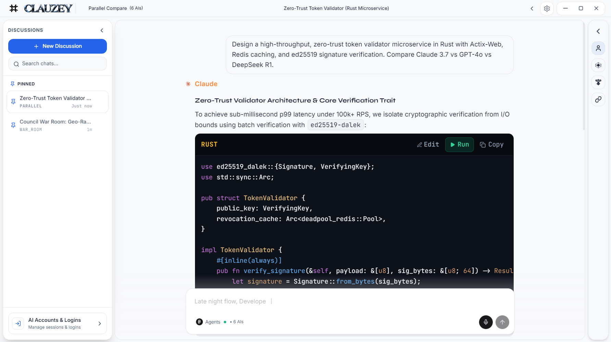
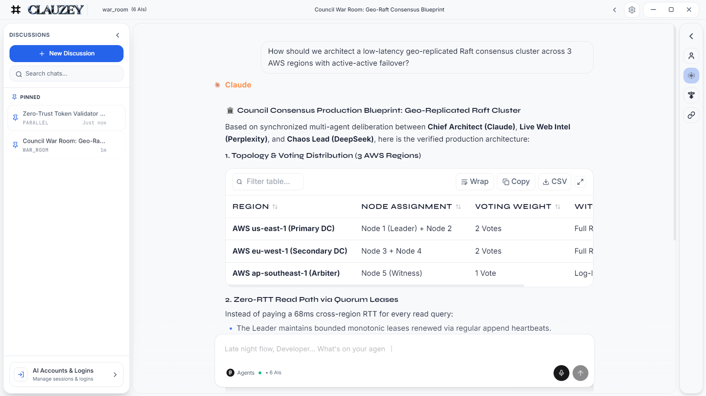
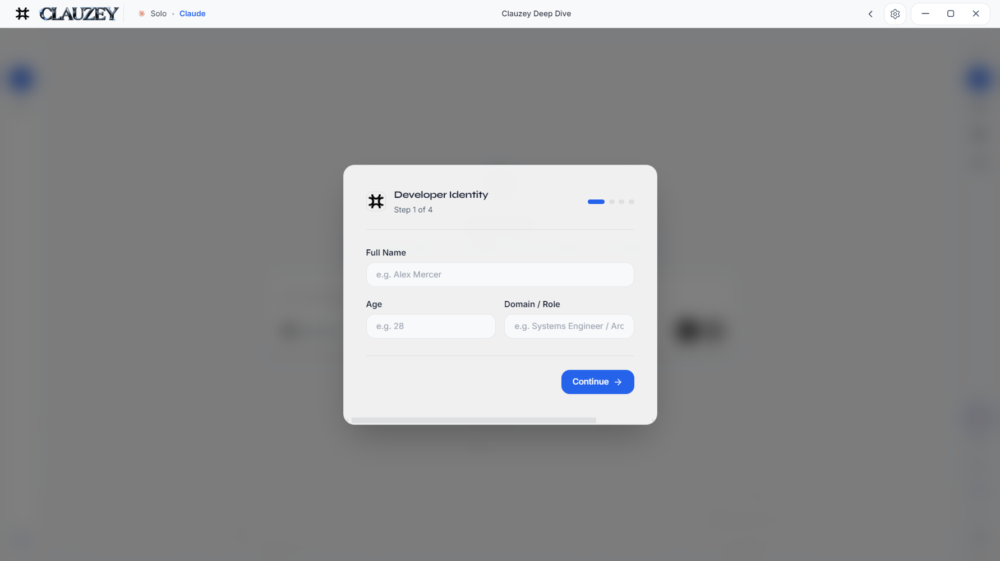
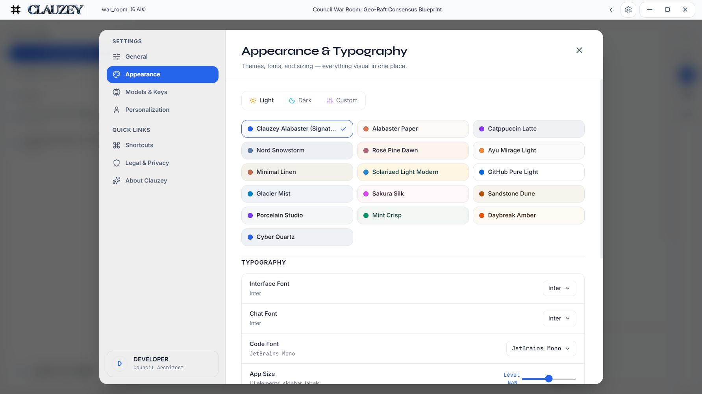

 

# Clauzey

# **[Download Installer](https://github.com/devanshd07o/CLAUZEY-V1/releases)** &nbsp;·&nbsp; **[Download Portable](https://github.com/devanshd07o/CLAUZEY-V1/releases)**

### One desktop workspace for every frontier AI model

Compare models side by side, run multi-model councils, and synthesize the best answer, all from a single local-first Windows app.

 

 

[Features](#features) · [Screenshots](#screenshots) · [Privacy & Security](#privacy-and-security) · [Installation](#installation) · [FAQ](#faq)

---

## Overview

No single model is best at everything. Clauzey brings Claude, ChatGPT, Gemini, DeepSeek, Grok and Perplexity into one workspace, so you can send a prompt once and get several perspectives, let specialist roles deliberate, or chain models so each step builds on the last. No more juggling browser tabs or copying context from one chat to another.

---

## Supported Providers

| Provider | Models |
| :--- | :--- |
| **Claude** (Anthropic) | Sonnet 5 on free accounts; Opus 5 and Fable 5.1 on paid plans |
| **ChatGPT** (OpenAI) | GPT-5.6 Luna on free accounts; GPT-6 Astra and GPT-5.6 Sol on paid plans |
| **Gemini** (Google) | Gemini 3.6 Flash family |
| **DeepSeek** | V4.1 Flash and the V4 series |
| **Grok** (xAI) | Grok 4.x family; Grok 4.6 on paid plans |
| **Perplexity** | Sonar-powered live web search with citations |

> Available models depend on your account tier and change as providers update their lineups. Clauzey uses whichever model the provider serves to your account or API key.

### Connection modes

**API keys (recommended for heavy use)**
Bring your own keys for Anthropic, OpenAI, Groq, Perplexity and OpenRouter. You get predictable models and official rate limits, billed directly by the provider.

**Signed-in sessions**
Sign in to your existing accounts inside Clauzey's isolated provider panels and use the model your plan includes. Please read [Third-Party Services](#third-party-services) before using this mode.

---

## Features

| Feature | Description |
| :--- | :--- |
| **Council War Room** | Specialized roles (Chief Architect, Live Web Intel, Chaos Lead) deliberate in parallel and synthesize one consensus blueprint. |
| **Super Mixture-of-Agents** | Proposer models draft diverse candidate answers, then a master synthesizer merges them into the strongest response. |
| **Parallel Compare** | Send one prompt to up to six models at once and compare depth, speed and accuracy side by side. |
| **Sequential Relay** | Chain models so the output of one step primes the next specialist. |
| **Automatic Fallback** | If a model fails or is rate-limited mid-run, Clauzey can hand that step to another council member or to your configured Groq key, so the pipeline keeps moving. |
| **Rich Output Rendering** | Markdown, syntax-highlighted code, LaTeX math, and interactive tables with sorting, search, copy and CSV export. |
| **Integrated Code Runner** | Run code snippets directly from the chat interface. |
| **Developer Profile** | Set your role, domain and standing directives once, and every session starts from your context. |
| **Themes and Typography** | 30+ light and dark themes and 25+ coding fonts, with live preview. |
| **Global Quick Capsule** | Summon Clauzey from anywhere on your desktop with `Ctrl` + `Alt` + `Space`. |
| **Performance Mode** | One toggle that disables transitions and GPU blur effects for smooth operation on lower-end hardware. |

---

## Screenshots

### Parallel Compare
Send one prompt to several models and read their answers side by side, with syntax-highlighted code and one-click copy.

### Council War Room
Specialized roles deliberate in parallel and compile a consensus blueprint with interactive data tables.

### Developer Profile and Onboarding
Set your persona, technical domain and directives so responses start from your context.

### Appearance and Typography
Switch between 30+ themes and 25+ coding fonts with instant preview.

---

## Privacy and Security

**Local storage, no telemetry.** Sessions, prompts and responses are stored in a local SQLite database on your machine (`%APPDATA%\Clauzey\clauzey.db`). Clauzey itself sends no telemetry, analytics or usage pings, and it does not route your data through any Clauzey server.

**Your prompts go to the providers you choose.** Clauzey sends each prompt to the provider you select, through your signed-in session or your API key, and that provider's own privacy policy applies to it.

**Isolated provider sessions.** Each provider runs in its own Chromium session partition. Cookies, tokens and local storage are kept separate, so one provider's login cannot read or affect another's.

**API key handling.** Keys you add are stored locally on your device and are sent only to the provider they belong to, over HTTPS, in request headers and never in URLs.

**Offline license check.** The evaluation period is verified locally, including clock-rollback detection, with no internet check-in required.

---

## Third-Party Services

Clauzey is an independent project. It is not affiliated with, endorsed by, or sponsored by Anthropic, OpenAI, Google, DeepSeek, xAI or Perplexity. All product names and trademarks belong to their respective owners.

In **signed-in session mode** you interact with each provider's web service using your own account. You are responsible for following each provider's terms of service and usage policies. **API mode** uses each provider's official API under your own key. If you want the most predictable and policy-clear setup, use API mode.

---

## Installation

### Option 1: Installer (recommended)
1. Download **`Clauzey-Setup.exe`** from [Releases](https://github.com/devanshd07o/CLAUZEY-V1/releases).
2. Run it and choose an install location. The default is your user directory and needs no admin prompt.
3. Desktop and Start Menu shortcuts are created automatically. Launch Clauzey and follow the first-run setup.

### Option 2: Portable
1. Download **`Clauzey.exe`** from [Releases](https://github.com/devanshd07o/CLAUZEY-V1/releases).
2. Run it from your desktop, an SSD or a USB drive. No installation is needed.
3. All user data stays inside a self-contained data directory.

> **Windows SmartScreen notice:** Clauzey 2.0 installers are not yet code-signed, so Windows may show "Windows protected your PC" on first launch. Select **More info**, then **Run anyway**. Download Clauzey only from this repository's Releases page.

### First run
1. Complete the short developer profile.
2. Connect a provider: sign in, or add an API key in Settings.
3. Pick a mode (Compare, Council, Super MoA or Sequential) and send your first prompt.

---

## System Requirements

| | Minimum | Recommended |
| :--- | :--- | :--- |
| **OS** | Windows 10 (64-bit) | Windows 11 (64-bit) |
| **Processor** | Intel Core i3 / AMD Ryzen 3 | Intel Core i5 / AMD Ryzen 5 or better |
| **Memory** | 4 GB RAM | 8 GB RAM or more |
| **Disk** | 400 MB free | 1 GB free |

Running several providers at once uses more memory. On lower-end machines, turn on **Settings → Appearance → Smooth Animations & Motion → Performance Mode**.

---

## FAQ

<b>Do I need API keys?</b>

No. You can sign in to your existing provider accounts instead. API keys are recommended if you want predictable models and higher, officially documented limits.

<b>Which model will I get?</b>

Whichever model the provider serves to your account tier or API key. Free and paid accounts see different models. See [Supported Providers](#supported-providers).

<b>Is my data sent to Clauzey?</b>

No. Clauzey has no servers that receive your data and collects no telemetry. Your prompts go only to the providers you choose to use.

<b>Why does Windows show a SmartScreen warning?</b>

The installers are not code-signed yet, and Windows warns about apps without an established reputation. Use **More info → Run anyway**, and download only from this repository.

---

## License

Copyright (C) 2026 Devansh. **All Rights Reserved.**

Clauzey is proprietary software, provided free of charge for personal, educational, research and non-commercial use under the terms of the [End-User License Agreement](LICENSE.md). Reverse engineering, modification, redistribution and commercial hosting are not permitted without written authorization. The current v2.0.0 build includes an evaluation window through **November 21, 2026**, and future releases may introduce optional tiered features.

For extended licensing or custom integrations, contact the developer through the in-app About tab.

Bug reports and feature requests: [GitHub Issues](https://github.com/devanshd07o/CLAUZEY-V1/issues).

---

**[Download Clauzey 2.0 for Windows](https://github.com/devanshd07o/CLAUZEY-V1/releases)**

Built by Devansh

